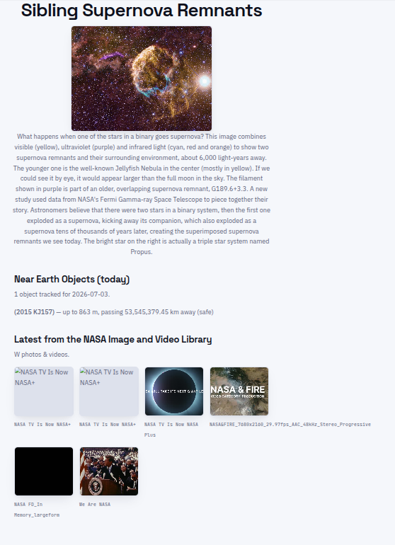

# coolNASAstuff
a site using NASA's api to fetch some cool stuff.

---

# Features
Fact/image of the day,
Near Earth objects today,
Latest from the NASA Image and Video Library.

---

# AI Declaration
I used no AI, other than for figuring out the NASA API syntax.
